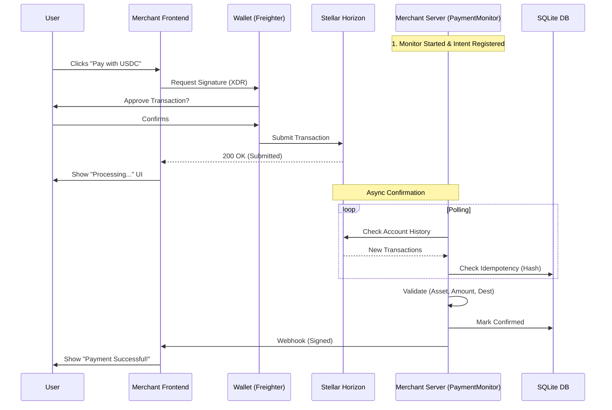

# USDC Payments SDK for Stellar — Technical Architecture

> Complete technical documentation for the USDC Payments SDK for Stellar (Web + Mobile)

---

## 🏗️ System Architecture

The SDK implements a split architecture to ensure security:
1.  **Frontend (Client):** Handles transaction creation, signing, and submission.
2.  **Backend (Server):** Handles payment monitoring, verification, and confirmation.

```mermaid
graph TB
    subgraph "Client Side (Browser)"
        A[React App] --> B[PayWithUSDC]
        B --> C[Wallet (Freighter)]
        C --> D[Stellar Horizon]
    end
    
    subgraph "Server Side (Node.js)"
        E[PaymentMonitor] --> D
        E --> F[Merchant Backend]
        E --> G[(SQLite DB)]
    end
    
    subgraph "Stellar Network"
        D --> H[Blockchain Ledger]
    end
```

---

## 📦 Package Structure

```
src/
├── components/
│   └── PayWithUSDC.tsx          # Main React component
├── core/
│   ├── createPaymentSession.ts  # Transaction creation logic
│   ├── signAndSubmit.ts         # Transaction signing & submission
│   └── freighterAdapter.ts      # Freighter wallet integration
├── server/                      # Server-side Module
│   ├── paymentMonitor.ts        # Blockchain monitoring logic
│   ├── webhookSender.ts         # Secure webhook delivery
│   ├── crypto.ts                # HMAC signatures
│   └── db.ts                    # SQLite persistence layer
├── types.ts                     # TypeScript type definitions
└── index.ts                     # Package exports
```

---

## 🔄 Payment Flow Architecture

### Sequence Diagram



---

## 🧩 Component Architecture

### PayWithUSDC Component (Client)

The client component is responsible **only** for facilitating the user's signing and submission process.

```typescript
interface PayWithUSDCProps {
  // Required props
  amount: number;
  destination: string;
  wallet: WalletAdapter;
  memo: string; // Critical for tracking the payment on server
  
  // Callbacks
  onSuccess?: (hash: string) => void; // Triggered when SUBMITTED
  onError?: (error: unknown) => void;
}
```

> **Note:** The `onSuccess` callback indicates the transaction was successfully broadcast to the network. It does **not** guarantee finality or correctness until verified by the server.

---

## 🔧 Server Verification Architecture

### PaymentMonitor (Server)

**Purpose:** Securely verifies payments on-chain and persists state.

**Persistence (SQLite):**
The `PaymentMonitor` automatically creates a `usdc_payments.db` file to store:
1.  **Pending Payments:** Intents waiting for confirmation.
2.  **Processed Hashes:** To prevent double-processing (idempotency).
3.  **Horizon Cursor:** To resume monitoring from the exact last processed transaction after a server restart.

**Process:**
1.  **Registration:** The backend registers a "Payment Intent". Saved to SQLite.
2.  **Monitoring:** Polling the Stellar Horizon API. On startup, it resolves the cursor (latest or stored) to ensure no skipped transactions.
3.  **Matching:** Matches incoming transactions by Memo (Session ID).
4.  **Validation:**
    *   `tx.destination == expected.destination`
    *   `tx.asset == expected.asset`
    *   `tx.amount >= expected.amount`
5.  **Confirmation:** If valid, updates status in SQLite and sends a signed webhook.

### Security Model

*   **Trust Boundary:** The Client is untrusted. The Server is trusted.
*   **Signatures:** Webhooks are signed with HMAC-SHA256 to prove origin.
*   **Idempotency:** The monitor tracks processed transaction hashes to prevent double-spending/double-counting.
*   **Persistence:** Ensures reliability even if the server crashes.

---

## 🌐 Network Configuration

### Testnet Configuration (Default)

```typescript
const TESTNET_CONFIG = {
  horizonUrl: "https://horizon-testnet.stellar.org",
  networkPassphrase: Networks.TESTNET,
};
```

### Mainnet Configuration

```typescript
const MAINNET_CONFIG = {
  horizonUrl: "https://horizon.stellar.org",
  networkPassphrase: Networks.PUBLIC,
};
```

---

## 🚀 Future Architecture (Roadmap)

### Phase 3: Websockets (Planned)
Direct WebSocket support to push confirmation events to the frontend client from the monitor.

---

## 📚 API Reference

See [api-reference.md](./api-reference.md) for detailed class and function definitions.
