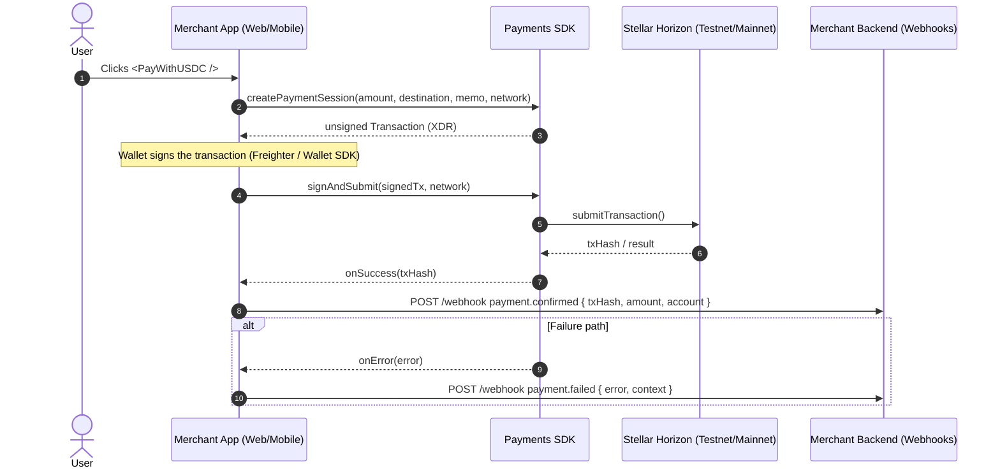
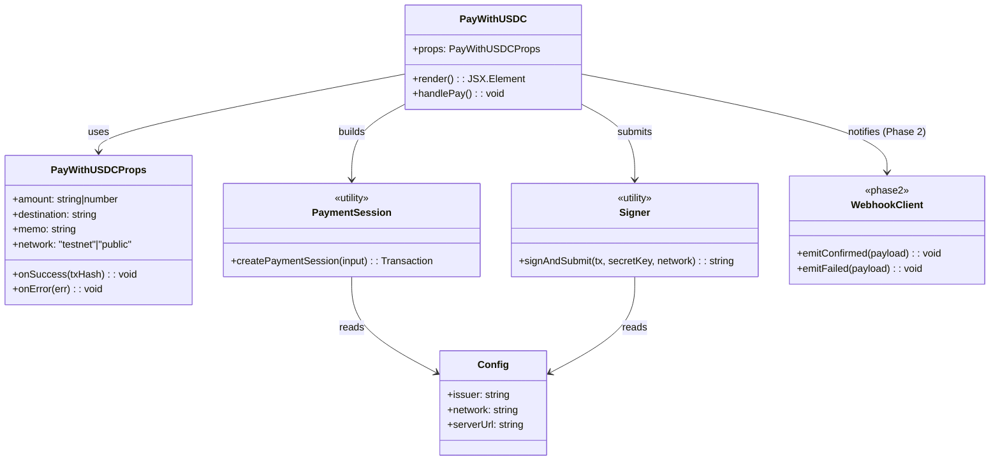
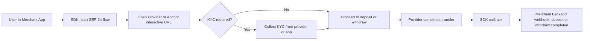

# USDC Payments SDK for Stellar — UML Diagrams (Mermaid)

> These diagrams are GitHub-friendly (Mermaid) and should render directly in the repo.

---

## 1) Payment Flow — Sequence Diagram

---

## 2) SDK Structure — Class Diagram

---

## 3) Optional — On/Off-ramp (SEP-24) Flow (Phase 2)

---

## Notes
- **Phase 1**: `PayWithUSDC`, `createPaymentSession`, `signAndSubmit`.
- **Phase 2**: Webhooks + SEP-24 helper modules.
- Replace secret handling with **wallet-based signing** (Freighter / Wallet SDK) in production.
