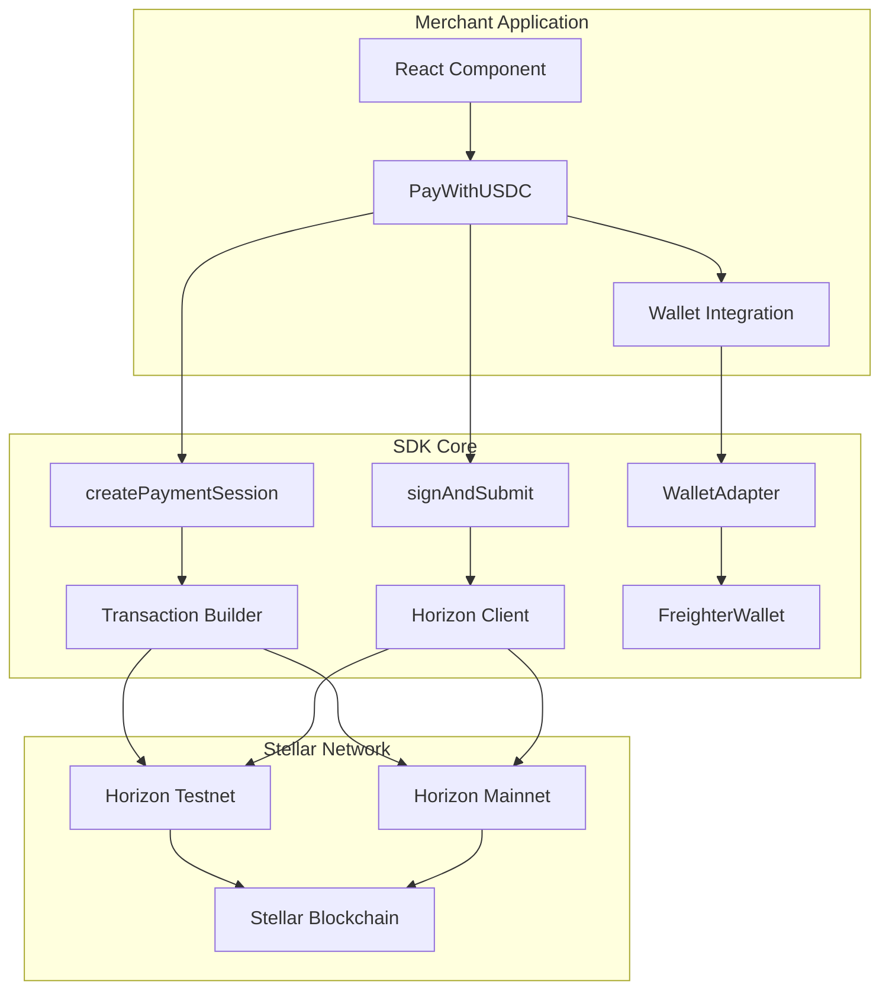
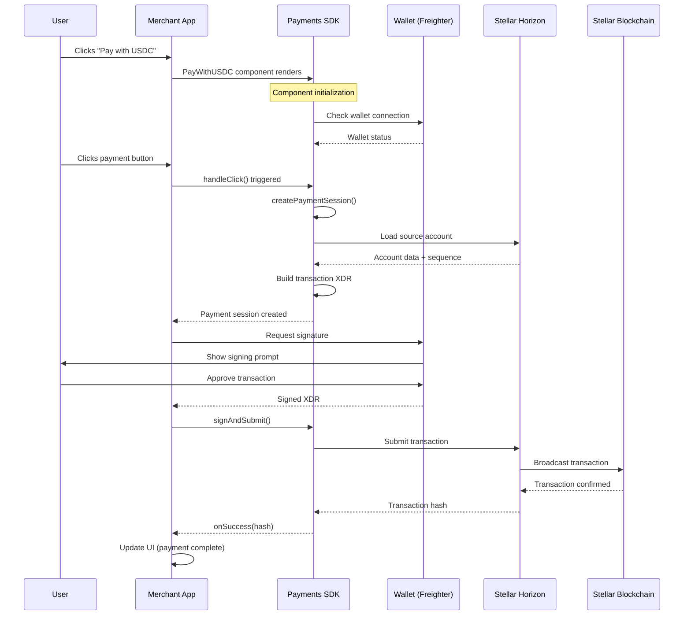
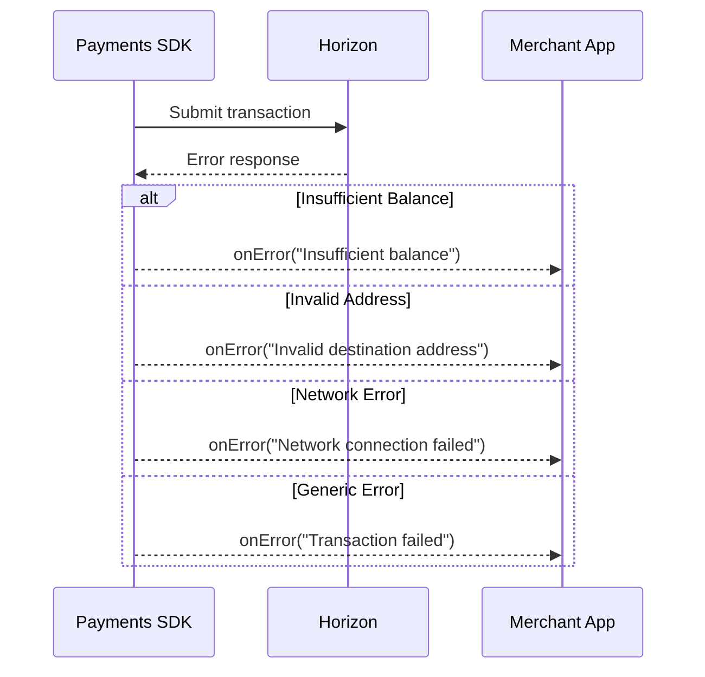
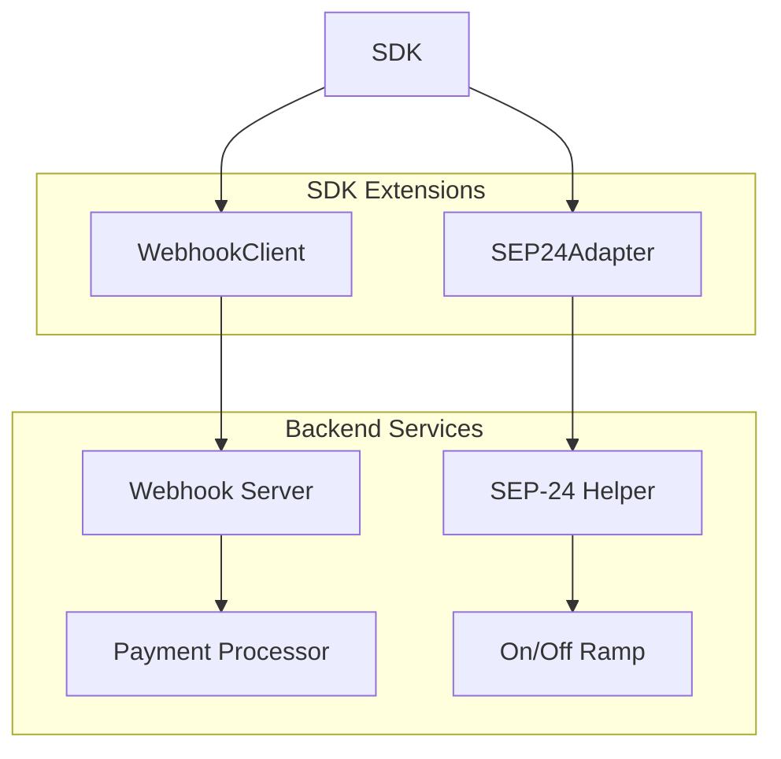
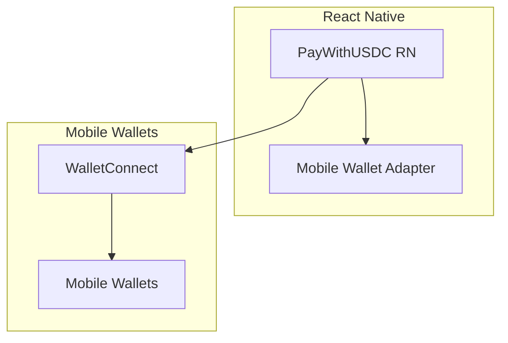

# USDC Payments SDK for Stellar — Technical Architecture

> Complete technical documentation for the USDC Payments SDK for Stellar (Web + Mobile)

---

## 🏗️ System Architecture

### High-Level Overview



---

## 📦 Package Structure

```
src/
├── components/
│   └── PayWithUSDC.tsx          # Main React component
├── core/
│   ├── createPaymentSession.ts  # Transaction creation logic
│   ├── signAndSubmit.ts         # Transaction signing & submission
│   └── freighterAdapter.ts      # Freighter wallet integration
├── types.ts                     # TypeScript type definitions
└── index.ts                     # Package exports
```

### Build Output

```
dist/
├── index.js                     # ESM bundle
├── index.cjs                    # CommonJS bundle
├── index.d.ts                   # TypeScript declarations
├── index.js.map                 # Source maps
└── index.mjs                    # ESM with .mjs extension
```

---

## 🔄 Payment Flow Architecture

### Sequence Diagram



### Error Handling Flow



---

## 🧩 Component Architecture

### PayWithUSDC Component

```typescript
interface PayWithUSDCProps {
  // Required props
  amount: number;
  destination: string;
  wallet: WalletAdapter;
  
  // Optional props
  assetCode?: string;           // Default: "XLM"
  issuer?: string;             // Required for non-native assets
  memo?: string;
  network?: NetworkName;       // Default: "TESTNET"
  source?: string;             // Optional source address
  label?: string;             // Default: "Pay"
  
  // Callbacks
  onSuccess?: (hash: string) => void;
  onError?: (error: unknown) => void;
}
```

### Component State Management

```typescript
const [loading, setLoading] = useState(false);

const handleClick = async () => {
  try {
    setLoading(true);
    
    // 1. Get wallet public key
    const publicKey = source ?? (await wallet.getPublicKey());
    
    // 2. Create payment request
    const request: PaymentRequest = {
      amount,
      assetCode,
      destination,
      memo,
      ...(assetCode !== "XLM" && { issuer })
    };
    
    // 3. Create payment session
    const session = await createPaymentSession(request, publicKey);
    
    // 4. Sign and submit
    const { hash } = await wallet.signAndSubmit(session.xdr, network);
    
    // 5. Success callback
    onSuccess?.(hash);
    
  } catch (error) {
    onError?.(error);
  } finally {
    setLoading(false);
  }
};
```

---

## 🔧 Core Functions Architecture

### createPaymentSession()

**Purpose:** Builds a Stellar payment transaction

**Input:**
```typescript
interface PaymentRequest {
  amount: number;
  assetCode: string;
  issuer?: string;
  destination: string;
  memo?: string;
}
```

**Process:**
1. **Validation** - Validate input parameters
2. **Account Loading** - Load source account from Horizon
3. **Asset Creation** - Create Asset object (native or custom)
4. **Operation Building** - Create payment operation
5. **Transaction Building** - Build complete transaction
6. **XDR Encoding** - Encode transaction as XDR

**Output:**
```typescript
interface PaymentSession {
  id: string;
  request: PaymentRequest;
  xdr: string;
}
```

### signAndSubmit()

**Purpose:** Signs and submits transaction to Stellar network

**Input:**
- `xdr: string` - Transaction XDR
- `secret: string` - Secret key for signing

**Process:**
1. **XDR Decoding** - Decode XDR back to transaction
2. **Signing** - Sign transaction with secret key
3. **Submission** - Submit to Horizon server
4. **Response Handling** - Process success/error response

**Output:**
```typescript
interface SubmitResult {
  hash: string;
}
```

---

## 🔌 Wallet Integration Architecture

### WalletAdapter Interface

```typescript
interface WalletAdapter {
  getPublicKey(): Promise<string>;
  signAndSubmit(xdr: string, network: NetworkName): Promise<{ hash: string }>;
}
```

### FreighterWallet Implementation

```typescript
export class FreighterWallet implements WalletAdapter {
  async getPublicKey(): Promise<string> {
    if (!window.freighterApi) {
      throw new Error("Freighter not found");
    }
    return window.freighterApi.getPublicKey();
  }

  async signAndSubmit(xdr: string, network: NetworkName): Promise<{ hash: string }> {
    if (!window.freighterApi) {
      throw new Error("Freighter not found");
    }
    const hash = await window.freighterApi.signAndSubmitXDR(xdr, { network });
    return { hash };
  }
}
```

### Global Type Declarations

```typescript
declare global {
  interface Window {
    freighterApi?: {
      isConnected: () => Promise<boolean>;
      getPublicKey: () => Promise<string>;
      signAndSubmitXDR: (xdr: string, opts: { network: NetworkName }) => Promise<string>;
    };
  }
}
```

---

## 🌐 Network Configuration

### Testnet Configuration (Default)

```typescript
const TESTNET_CONFIG = {
  horizonUrl: "https://horizon-testnet.stellar.org",
  networkPassphrase: Networks.TESTNET,
  friendbotUrl: "https://friendbot.stellar.org"
};
```

### Mainnet Configuration

```typescript
const MAINNET_CONFIG = {
  horizonUrl: "https://horizon.stellar.org",
  networkPassphrase: Networks.PUBLIC,
  friendbotUrl: null // No friendbot on mainnet
};
```

### Network Selection

```typescript
type NetworkName = "TESTNET" | "PUBLIC";

function getNetworkConfig(network: NetworkName) {
  return network === "TESTNET" ? TESTNET_CONFIG : MAINNET_CONFIG;
}
```

---

## 📊 Asset Support Architecture

### Native Assets (XLM)

```typescript
const xlmAsset = Asset.native();
```

### Custom Assets (USDC, etc.)

```typescript
const usdcAsset = new Asset("USDC", "GADGV62S2PRYD4HGRB3DPSYRH64X2EXMNPPTELVD4EKJ6LFL76STFGSL");
```

### Asset Validation

```typescript
function validateAsset(assetCode: string, issuer?: string): Asset {
  if (assetCode.toUpperCase() === "XLM") {
    return Asset.native();
  }
  
  if (!issuer) {
    throw new Error("Issuer required for non-native assets");
  }
  
  return new Asset(assetCode, issuer);
}
```

---

## 🛠️ Build System Architecture

### tsup Configuration

```typescript
export default defineConfig({
  entry: ["src/index.ts"],
  format: ["esm", "cjs"],        // Dual format support
  dts: true,                     // TypeScript declarations
  sourcemap: true,               // Source maps for debugging
  clean: true,                   // Clean dist before build
  minify: false,                 // No minification for dev
  target: "es2020",              // Modern JavaScript target
  skipNodeModulesBundle: true,    // Don't bundle dependencies
  splitting: false,               // Single bundle
  external: ["react", "react-dom"], // External React dependencies
});
```

### Package.json Exports

```json
{
  "main": "./dist/index.cjs",
  "module": "./dist/index.js",
  "types": "./dist/index.d.ts",
  "exports": {
    ".": {
      "import": "./dist/index.js",
      "require": "./dist/index.cjs"
    }
  }
}
```

---

## 🧪 Testing Architecture

### Sandbox Testing (`sandbox.mjs`)

**Purpose:** End-to-end testing of SDK functionality

**Test Flow:**
1. **Account Creation** - Generate random keypair
2. **Account Funding** - Fund via Friendbot
3. **Payment Session** - Create payment transaction
4. **Transaction Submission** - Sign and submit
5. **Component Mock** - Demonstrate component usage

### Next.js Example App

**Purpose:** Real-world integration example

**Features:**
- Complete React integration
- Wallet adapter usage
- Error handling demonstration
- Success callback examples

---

## 🔒 Security Architecture

### Private Key Handling

⚠️ **Never expose private keys in production!**

**Development (Testnet Only):**
```typescript
// Only for testing - never in production
const secret = "S...SECRETKEY";
const result = await signAndSubmit(xdr, secret);
```

**Production (Wallet Integration):**
```typescript
// Secure wallet integration
const wallet = new FreighterWallet();
const result = await wallet.signAndSubmit(xdr, "TESTNET");
```

### Network Security

- **Testnet** - Safe for development and testing
- **Mainnet** - Production use only with proper security measures
- **HTTPS** - All Horizon communication over HTTPS
- **Validation** - Input validation for all user data

---

## 📈 Performance Considerations

### Bundle Size Optimization

- **External Dependencies** - React/React-DOM marked as external
- **Tree Shaking** - ESM format enables tree shaking
- **Code Splitting** - Single bundle for simplicity
- **Source Maps** - Available for debugging

### Runtime Performance

- **Async Operations** - All network calls are async
- **Error Boundaries** - Proper error handling prevents crashes
- **Loading States** - UI feedback during operations
- **Caching** - Account data cached during session

---

## 🚀 Future Architecture (Roadmap)

### Phase 2: Backend Integration



### Phase 3: Mobile Support



---

## 📚 API Reference

### Core Exports

```typescript
// Main component
export { default as PayWithUSDC } from "./components/PayWithUSDC";

// Core functions
export { createPaymentSession } from "./core/createPaymentSession";
export { signAndSubmit } from "./core/signAndSubmit";

// Wallet adapters
export { FreighterWallet } from "./core/freighterAdapter";

// Types
export type { 
  PaymentRequest, 
  PaymentSession, 
  WalletAdapter, 
  NetworkName 
} from "./types";
```

### Type Definitions

```typescript
export type NetworkName = "TESTNET" | "PUBLIC";

export type PaymentRequest = {
  amount: number;
  assetCode: string;
  issuer?: string;
  destination: string;
  memo?: string;
};

export type PaymentSession = {
  id: string;
  request: PaymentRequest;
  xdr: string;
};

export interface WalletAdapter {
  getPublicKey(): Promise<string>;
  signAndSubmit(xdr: string, network: NetworkName): Promise<{ hash: string }>;
}
```

---

## 🔧 Development Guidelines

### Code Style

- **TypeScript** - Strict type checking enabled
- **ESLint** - Code quality and consistency
- **Prettier** - Code formatting
- **Conventional Commits** - Standardized commit messages

### Testing Strategy

- **Unit Tests** - Core function testing
- **Integration Tests** - Component testing
- **E2E Tests** - Sandbox testing
- **Manual Testing** - Next.js example app

### Documentation Standards

- **JSDoc** - Function documentation
- **README** - Usage examples
- **Architecture** - Technical documentation
- **API Reference** - Complete API documentation

---

**This architecture document is maintained alongside the codebase and updated with each major release.**