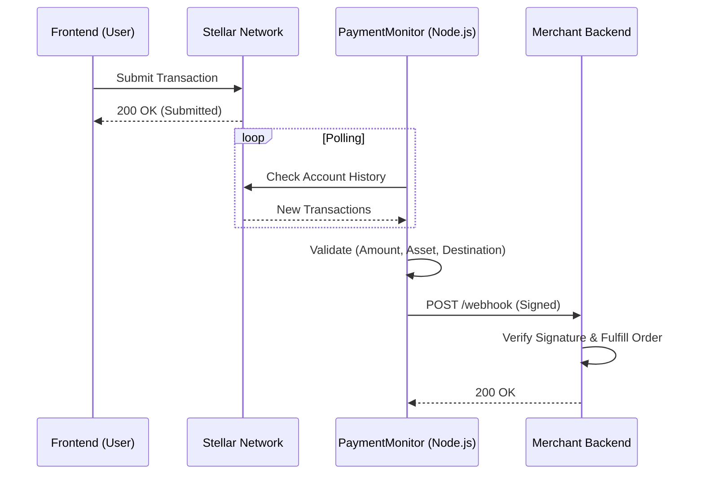

# 🔗 Webhook Support & Server Verification

The USDC Payments SDK uses a **Server-Side Verification** model. This ensures that payment confirmations are secure, trusted, and cannot be spoofed by malicious clients.

> **⚠️ Security Note:** Client-side callbacks (`onSuccess` in the React component) indicate only that a transaction was *submitted*. Never trust the client for payment confirmation. Always verify on the server.

---

## 🏗️ Architecture

Instead of the browser sending webhooks (which is insecure), you run a **Payment Monitor** on your backend (or as a separate microservice).

1. **Frontend:** User signs and submits transaction.
2. **Blockchain:** Transaction is processed and included in a ledger.
3. **PaymentMonitor (Server):** Detects the confirmed transaction via Stellar Horizon.
4. **Webhook:** `PaymentMonitor` sends a signed HTTP request to your main backend.



---

## 🚀 Setting Up the Payment Monitor

The `PaymentMonitor` class is available in the server module of the SDK.

### 1. Initialize the Monitor

```typescript
import { PaymentMonitor } from '@zacksonpessoa/usdc-payments-sdk/server';

const monitor = new PaymentMonitor(
  "TESTNET",                      // Network ("TESTNET" or "PUBLIC")
  "G_MERCHANT_WALLET_ADDRESS",    // The account receiving funds
  {
    url: "https://api.yoursite.com/webhooks/payment", // Your webhook endpoint
    secret: "whsec_..."           // Secret for HMAC signing
  },
  {
    timeoutMinutes: 15            // Stop tracking a payment after 15 mins
  }
);

// Start polling
monitor.start();
```

### 2. Register Payment Intents

When your user initiates a checkout flow, register the expected payment on your server. This tells the monitor what to look for.

```typescript
// Example: Inside your "Create Order" API route
const sessionId = "order_123_abc";

monitor.registerPayment(sessionId, {
  amount: 50,
  assetCode: "USDC",
  issuer: "GADGV62S2PRYD4HGRB3DPSYRH64X2EXMNPPTELVD4EKJ6LFL76STFGSL",
  destination: "G_MERCHANT_WALLET_ADDRESS",
  memo: sessionId // The memo must match the session ID/Order ID
});
```

---

## 📨 Webhook Payload

When a payment is confirmed, the monitor sends a POST request with the following JSON body:

```json
{
  "id": "evt_1703123456789",
  "type": "payment.confirmed",
  "timestamp": "2023-12-21T10:30:45.123Z",
  "sessionId": "order_123_abc",
  "transactionHash": "abc123def456...",
  "paymentRequest": {
    "amount": 50,
    "assetCode": "USDC",
    "issuer": "GADGV...",
    "destination": "G_MERCHANT...",
    "memo": "order_123_abc"
  },
  "metadata": {
    "sender": "G_USER_WALLET...",
    "amount": "50.0000000",
    "asset": "USDC"
  }
}
```

---

## 🔒 Verifying Signatures

To ensure the webhook actually came from your trusted monitor (and not an attacker), verify the `X-Signature` header.

### Node.js (Express) Example

```typescript
import { verifySignature } from '@zacksonpessoa/usdc-payments-sdk/server';

app.post('/webhooks/payment', (req, res) => {
  const signature = req.headers['x-signature'];
  const payload = JSON.stringify(req.body); // Raw body string
  const secret = process.env.WEBHOOK_SECRET;

  if (!verifySignature(payload, signature, secret)) {
    console.error("Invalid signature attempt");
    return res.status(401).send("Unauthorized");
  }

  // Signature is valid. Process the order.
  const { sessionId, transactionHash } = req.body;
  console.log(`Order ${sessionId} paid via ${transactionHash}`);
  
  res.status(200).send("OK");
});
```

---

## 🛡️ Security & Reliability Features

The `PaymentMonitor` enforces strict security rules before firing a webhook:

1.  **Destination Check:** Funds must have arrived at the specific monitored address.
2.  **Asset Validation:** Checks `asset_code` and `asset_issuer` exactly match the registered intent (prevents fake token scams).
3.  **Amount Validation:** Checks `received_amount >= requested_amount` (prevents underpayment).
4.  **Idempotency:** A transaction hash is processed only once per running instance.
5.  **Expiration:** Unpaid intents expire after the configured timeout (default 15 mins).
6.  **Persistence:** Uses a local SQLite database (`usdc_payments.db`) to persist pending intents and the last processed Horizon cursor. This ensures that **no payments are missed** if the server restarts.

---

## 🔮 Roadmap

- [ ] Support for Websockets for real-time frontend updates.
- [ ] Support for multiple monitored accounts.
